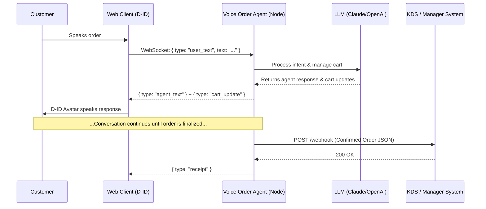

<div align="center">
  
  <h1>🎙️ Voice Ordering Agent</h1>
  <p><strong>A Next-Generation Conversational Ordering Backend 
             </strong></p>
  Deployed URL: https://voiceorderingagent.onrender.com/avatar-client.html 
  <p>
    <a href="https://nodejs.org"></a>
    <a href="https://expressjs.com"></a>
    <a href="https://developer.mozilla.org/en-US/docs/Web/API/WebSockets_API"></a>
  </p>
</div>

---

## 📖 Overview

The **Voice Order Agent** is a specialized conversational backend designed exclusively to handle AI-driven food ordering flows. It acts as the intelligent bridge between voice-enabled customer frontends (like kiosks or web apps) and your Kitchen Display System (KDS) or Order Manager. 

It takes text turns in, manages the cart dynamically, and hands off a confirmed, structured order via a webhook payload. 

### 🎯 Scope & Boundaries
To keep the architecture modular and scalable, this service strictly owns the **conversational logic**. 

**What it does NOT do:**
- ❌ **Speech-to-Text / Text-to-Speech:** Bring your own! (Or use the browser's native API).
- ❌ **Avatar Rendering:** Handled by the client (D-ID integration is included out of the box).
- ❌ **Payments & Receipts:** The manager system owns payment capture and email/SMS delivery.
- ❌ **Long-term Persistence:** Order history belongs in your main database.

---

## 🏗️ Architecture & Flow



---

## 🚀 Getting Started

### 1. Prerequisites
- **Node.js** (v16 or higher)
- **API Keys**:
  - `ANTHROPIC_API_KEY` or `OPENAI_API_KEY` (depending on your LLM setup)
  - `DID_AGENT_ID` & `DID_CLIENT_KEY` (For the browser avatar)

### 2. Local Installation

```bash
# Clone the repository
git clone https://github.com/soraminds-robolink/assignment-mayank-sharma.git
cd assignment-mayank-sharma

# Install dependencies
npm install

# Setup environment variables
cp .env.example .env

# Start the server
npm start
```
*The server will start on `http://localhost:8090` (or your configured `PORT`).*

---

## 🔌 Integration Contract

### 1. Start a Session
Initiate a new conversation to receive a dedicated WebSocket path.
```http
POST /session
```
**Response:**
```json
{ 
  "session_id": "ab12-cd34-ef56", 
  "ws_path": "/agent/ab12-cd34-ef56" 
}
```

### 2. Connect & Talk (WebSocket)
Connect your frontend to `ws://<host>:<port><ws_path>`.

**Client → Server:**
```json
{ "type": "user_text", "text": "I'd like two chicken biryanis." }
```

**Server → Client (Streamed updates):**
```json
{ "type": "agent_text", "text": "Got it, two chicken biryanis. Anything else?" }
{ "type": "cart_update", "cart": [...] }
{ "type": "order_confirmed", "order": {...} }
{ "type": "receipt", "receipt_text": "..." }
```

### 3. The Webhook Handoff
When the customer confirms the order, this agent securely POSTs a structured JSON payload to your `MANAGER_WEBHOOK_URL`:

```json
{
  "tenant_id": "spicehub-kitchen",
  "customer_name": "Priya",
  "fulfillment": "pickup",
  "phone": "+15551234567",
  "items": [
    { "item_id": "chicken-biryani", "name": "Chicken Biryani", "quantity": 2, "unit_price": 13.99 }
  ],
  "subtotal": 27.98,
  "currency": "USD"
}
```

---

## 🎭 Avatar Integration (D-ID)

The service includes a pre-built web client (`public/avatar-client.html`) that uses **D-ID** for ultra-realistic, lip-synced avatar rendering. 

1. Create a D-ID agent and generate a client key.
2. Add them to your `.env` as `DID_AGENT_ID` and `DID_CLIENT_KEY`.
3. The frontend fetches these via `/avatar-config` and connects directly to D-ID via WebRTC. The Node service never processes heavy video/audio streams—it just tells the avatar *what to say*.

---

## ☁️ Deployment

This application is ready to be deployed to container-based PaaS providers like **Render**, **Railway**, or **Fly.io**. 

> **⚠️ Important Architectural Note:**
> Because this service currently uses in-memory `Map` data structures to store sessions, **it must be deployed as a single instance**. If you wish to scale horizontally across multiple instances, the in-memory map must first be swapped out for **Redis**.

---

## 🛠️ Known Gaps & Future Improvements
- **Security:** Add JWT or API Key authentication to `/session` and the Webhook route before going to production.
- **Session Management:** Implement session TTLs to clean up abandoned carts.
- **Scalability:** Migrate session state from a local `Map` to Redis for multi-node deployments.
- **Resilience:** Add WebRTC reconnection logic in the frontend if the D-ID connection drops.

---
<div align="center">
  <i>Engineered for seamless ordering experiences.</i>
</div>
